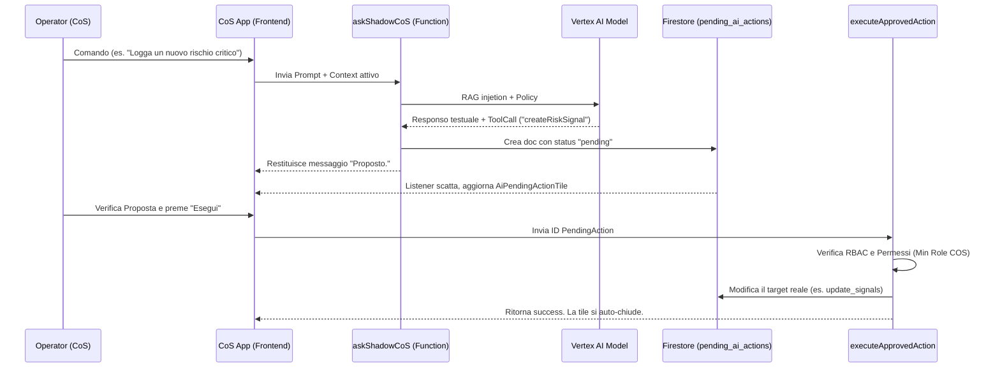

# CoS App (Chief of Staff OS)

## Introduzione
**CoS App** è una piattaforma avanzata progettata per supportare i **Chief of Staff (CoS)** e i dirigenti C-Level nell'esecuzione e nel monitoraggio strategico. Al centro dell'esperienza risiede lo **Shadow CoS**, un agente di Intelligenza Artificiale basato sui modelli Google Vertex AI (Gemini Pro/Flash), in grado di fornire orchestrazione proattiva, insight strategici contestualizzati e deleghe esecutive tramite comandi vocali e testuali.

L'interfaccia principale utilizza un layout di cruscotto "X-Matrix" dinamico (Bento Grid) che allinea visivamente le priorità giornaliere, la bussola a lungo termine (North Star), gli obiettivi annuali e i KPI operativi.

---

## Architettura e Stack Tecnologico

L'applicazione segue un'architettura **Serverless Event-Driven** basata su logica "Human-in-the-Loop" (HITL).
1. **Frontend**: Applicazione Single Page (SPA) costruita con **React 19**, **Vite**, **Tailwind CSS 4** (per il design glassmorphism e il dark mode istituzionale), e **Framer Motion** per le micro-animazioni.
2. **Backend**: **Firebase Functions (Node.js)** che espongono l'API dell'Intelligenza Artificiale, le regole di validazione e le funzioni batch/orchestrali.
3. **Database**: **Firebase Firestore**, protetto da regole di sicurezza stringenti.
4. **Intelligenza Artificiale**: Integrazione con **Google Vertex AI** (`gemini-2.0-pro-exp`) per i ragionamenti strategici complessi e task di automazione, e `gemini-2.0-flash` per risposte a bassa latenza (voice streaming).
5. **Autenticazione & RBAC**: Firebase Authentication con ruoli utente salvati a DB (GUEST, STAFF, C_LEVEL, COS, ADMIN) che governano pesantemente quali azioni l'IA è autorizzata a proporre (Policy AI Action).

---

## Diagramma Architetturale

```mermaid
graph TD
    subgraph Frontend [Client - React SPA]
        UI[AppShell & X-Matrix Dashboard]
        Voice[Voice Interaction / Live Session]
        Toolbox[Toolbox & Strategy Pages]
    end

    subgraph Backend [Firebase Cloud Functions]
        AskShadow[askShadowCoS Function]
        ExecAction[executeApprovedAction]
        Vertex(Vertex AI Generative API)
    end

    subgraph Database [Firestore]
        Users[(Users & RBAC)]
        PendingActions[(pending_ai_actions)]
        Signals[(Signals/OKRs/Events)]
    end

    UI -->|Richiesta Testuale/Vocale| AskShadow
    AskShadow <-->|Invia Contesto + Query| Vertex
    Vertex -->|Genera Azioni & Tool Call| AskShadow
    AskShadow -->|Scrive Proposta in Pending| PendingActions
    AskShadow -.->|Ritorna Risposta Testuale| UI
    
    UI -->|Approvazione Umana (HITL)| ExecAction
    ExecAction -->|Verifica RBAC & Esegue| Signals
```

---

## Manuale d'Uso (Core Features)

### 1. Cruscotto Strategico X-Matrix (Bento Grid)
- **Cos'è**: La `Dashboard.jsx`, orchestrata tramite la `DynamicBentoGrid.jsx`, offre una visione olistica "a bussola" della strategia aziendale. Trasforma gli obiettivi testuali in widget interattivi mappati ai punti cardinali (Nord: Focus, Sud: Long-term, Ovest: Obiettivi Annuali, Est: Radar/KPI).
- **Interazione**: Da mobile la visualizzazione è a singola colonna scorrevole, mentre su desktop rispetta il layour asimmetrico 9-tile (C-Suite). Cliccando sui vari quadranti è possibile ispezionare OKR, Segnali di Rischio o le priorità del giorno. Se la griglia non compare e c'è il modulo "Onboarding", significa che lo strategy setup iniziale non è stato completato. È possibile ricalibrare (fare il re-setup) tramite il bottone in basso `Ricalibra` o hoverando sulla mappa del Mission Summary.
- **Logica**: Utilizza il file `src/utils/mapStrategyToGrid.js` per convertire il contesto operativo del DB (`mission Context`) nelle istruzioni per disporre i contenuti della griglia CSS interattiva.

### 2. Shadow CoS AI (Intelligenza Artificiale Vocale e Testuale)
- **Cos'è**: L'orb (Sfera) al centro del cruscotto ("CommandNeuralCore") è l'avatar dell'agente AI. Reagisce in tempo reale al microfono simulando stati di pensiero e ascolto.
- **Interazione**: 
  - *Vocale:* Toccando la Sfera centrale da smartphone, si avvia in background una *Live Session* di OpenAI/Vertex streaming. Il CoS può dettare comandi (es: "Aggiungi uno stakeholder", "Segnala questo nuovo rischio").
  - *Testuale:* Dal command bar in alto l'utente può chattare testualmente col sistema in qualsiasi pagina e consultare il Copilot Dialogue laterale.
- **Logica**: Quando l'IA deduce che serve applicare una funzione nel DB (tool call), l'Azione non viene eseguita a scatola chiusa. L'azione appare magicamente nella UI sottoforma di "card in attesa" all'interno del riquadro `AiPendingActionTile.jsx`. Solo quando l'umano preme **"✅ Esegui"** l'effetto diventa permanente nel sistema (Human-in-the-Loop).

### 3. Moduli di Approfondimento (Pagine Stratificate)
- **Daily / Weekly Steering (`DailyPage.jsx`, `WeeklyPage.jsx`)**: Spazi di regia dove il CoS decide le mosse a breve termine. L'IA accede a questi layer per estrarre la priorità del giorno.
- **Stakeholder Registry (`StakeholderPage.jsx`)**: Hub per il monitoraggio della mappa del potere aziendale e delle relazioni.
- **Strategic Themes (`StrategicThemesPage.jsx`)**: Gestione dei macro-orizzonti di progetto (Horizon 1, 2, 3).

---

## Gestione dei Dati (Firestore & Script Batch)

L'architettura dei dati in Firestore è orientata alle entità e fortemente "Audited":
- Ogni azione distruttiva o costruttiva effettuata via AI è registrata nella collezione `audit_logs` con traccia ID dell'utente, timestamp e diff delle modifiche (`functions/index.js -> writeAuditLog`).
- **Recupero del "Contesto":** Molte Cloud Functions includono una sotto-funzione `fetchContext()` che compila massivamente tutti i dati vitali aperti (pulse giornalieri, OKR a rischio, decision log recenti, meeting programmati). L'IA non parla a vuoto, riceve un mega-json crudo del contesto corrente e ci ragiona sopra per produrre le risposte.
- **RAG & Auto-Archive**: Quando i layer di ricerca web o la generazione dei dossier producono testi lunghi, l'IA è obbligata a usare lo strumento `archiviaDocumento` (`intelligence_archive`). Quando all'utente serve quel background, l'API effettua vector search o fetch aggregato per usare quei dossier come "RAG" (Retrieval-Augmented Generation).

---

## Diagramma di Flusso Dati: Il Ciclo Human-in-the-Loop (HITL)



---

## Guida all'Installazione e Setup

### 1. Requisiti di base
- **Node.js** v20+ 
- Firebase CLI (`npm install -g firebase-tools`)
- Un progetto Firebase configurato sul piano Blaze (le Function `v2` lo richiedono).

### 2. Clonazione e Setup
```bash
git clone https://github.com/thomasmilici/C-Suite.git
cd C-Suite
npm install
```

### 3. Variabili d'Ambiente
Creare un file `.env` o configurare le variabili d'ambiente per Firebase SDK/Vite, ad esempio:
```env
VITE_FIREBASE_API_KEY="..."
VITE_FIREBASE_AUTH_DOMAIN="..."
VITE_FIREBASE_PROJECT_ID="..."
VITE_FIREBASE_STORAGE_BUCKET="..."
VITE_FIREBASE_MESSAGING_SENDER_ID="..."
VITE_FIREBASE_APP_ID="..."
```
Per le Cloud Functions, assicurarsi che le variabili di Google Cloud Service Account (ADC - Application Default Credentials) siano correttamente impostate se runnate in produzione.

### 4. Avvio ambiente Frontend (Sviluppo Locale)
```bash
# Avvia e lancia Vite Development Server sulla porta 5173
npm run dev
```

### 5. Avvio ambiente Backend/Emulazione (Opzionale)
Se si desidera emulare il backend per testare le chiamate AI e i batch worker (dal ramo `functions/`):
```bash
cd functions
npm install
firebase emulators:start --only functions,firestore
```

---

## Script Disponibili (package.json)

Questi i comandi utilizzabili dalla root del workspace:

| Comando | Descrizione |
|--|--|
| `npm run dev` | Lancia il server di sviluppo front-end (Vite) con Hot Module Replacement (HMR). |
| `npm run build` | Impacchetta l'app frontend per la produzione all'interno della cartella `dist`. |
| `npm run preview` | Avvia un server web locale leggero per scorrere la build di produzione. |
| `npm run lint` | Esegue il linter per validare la correttezza formale di stile sul codice JS/JSX. |

---

> **Work in Progress (Note finali)**: L'implementazione completa dei vettori "SVG" per intrecciare graficamente le carte sulla matrice correlazionale citata in `mapStrategyToGrid.js` non è ancora del tutto ultimata ma funge da segnaposto per futuri update. Allo stesso modo, alcuni aggiornamenti "Proattivi" per l'AI verranno schedulati.
